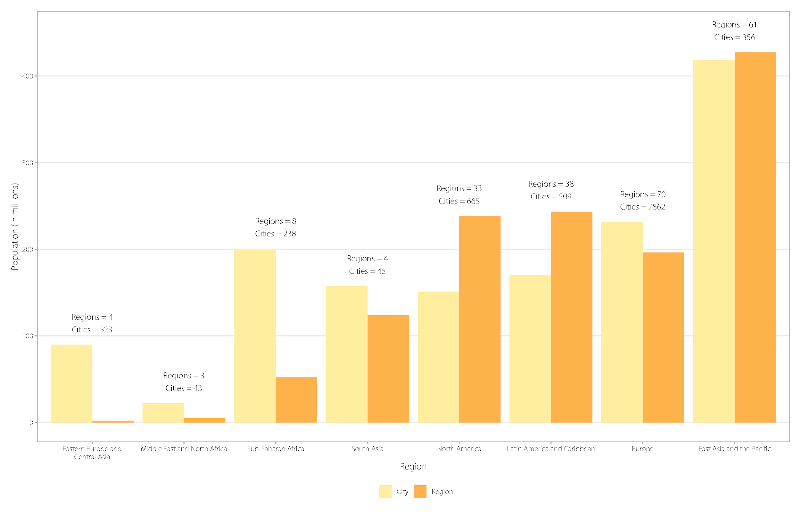
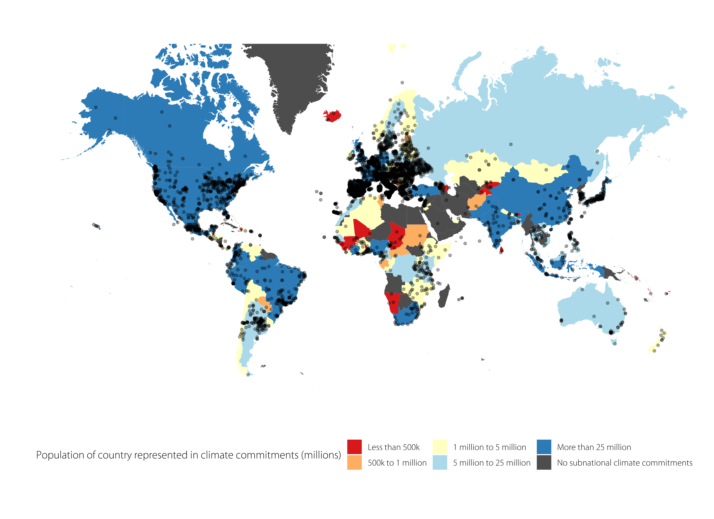

  
```{r setup, include=FALSE}
knitr::opts_chunk$set(echo = TRUE, fig.align = "center")
library(ClimActor)
```

As more non-state (i.e., cities, regions, and companies) actors commit to climate action, new initiatives and databases recording such commitments have also become more commonplace. Many actors commit to multiple initiatives and appear in more than one database, yet appear across databases with slightly different names. This discrepancy makes data cleaning and wrangling more difficult than it should be and can result in over-counting of actor's climate commitments if not dealt with appropriately. 

This package provides a workflow to efficiently standardize actor names across different databases and clean climate commitment data when analyzing non-state actors' climate commitments. 


```{r, fig.align = "center", echo = F,fig.fullwidth=T, out.width="140%",fig.cap="R Package User Workflow"}
knitr::include_graphics("r_package_workflow.png")

```

## Data

The data used in this vignette comes from the Carbon Disclosure Project's 2018-2019 City-wide emissions data. The data can be downloaded [here](https://data.cdp.net/Emissions/2018-2019-City-wide-emissions/k7qn-m6i9). Metadata of the dataset is also documented in the link above. 

```{r, include = FALSE}
path <- system.file("extdata", "2018_-_2019_City-wide_emissions.csv", 
                    package = "ClimActor", mustWork = T)
cdp <- read.csv(path, stringsAsFactors = F,
                as.is = T, encoding = "UTF-8")
```

With data read in (as `cdp`)

``` {r}
dim(cdp)

# Quick peek at the data
knitr::kable(head(cdp[, 1:5]))
```

Apart from the data to be clean, two other important datasets included in the ClimActor package are crucial to the data cleaning process. These datasets are the key dictionary (`key_dict`) and country dictionary (`country_dict`), and can be accessed once the `ClimActor` package has been called with either `library(ClimActor)` or `require(ClimActor)`. For more details on the two dictionaries, you can use `?key_dict` and `?country_dict` for the full data documentation.  

```{r}
knitr::kable(head(key_dict[, 1:5]))
knitr::kable(head(country_dict[, 1:5]))
```

Finally, the `ClimActor` package also comes with a subnational contextuals database which contains contextuals information such as population, lat/lng, and information on which initiatives actors have committed to. This dataset can be accessed by calling `contextuals`. 

```{r}
knitr::kable(head(contextuals[, c("name", "iso", 
                                  "entity_type", "initiatives_committed",
                                  "num_commit")]))
```


## Data Preparation functions

Naturally, the first step in any data cleaning pipeline is to read in and prepare the data.

Within the `ClimActor` workflow the first important step comes when the data is read in. For the later string matching aspects of the workflow to work more accurately, the data should ideally be read in or converted to **UTF-8** encoding. **UTF-8** is the preferred encoding when working with strings and both the `key_dict` and `country_dict` are encoded in UTF-8 encoding. Reading in data with the UTF-8 encoding can be done by using the `encoding` argument within the `read.csv` function. 

If you know the encoding of your data, it is best to convert it to UTF-8 (either within R or elsewhere) before proceeding with the string matching algorithms. If you are unsure of the encoding of your data, it is more important to read the data into R in its correct native encoding rather than to try and force the wrong encoding (eg. reading in data as UTF-8 when the data is encoded in Latin1). For those who are unfamiliar with encoding issues, an (optional) helper function within some string matching functions will try to guess the encoding of your data and fix it. For more information on the helper function, see the code in the github [here](https://github.com/datadrivenyale/ClimActor/blob/master/R/helper_functions.R). 

If you would like to learn more about encoding in R, you can refer to the Appendix (*Notes on encoding*) of this vignette or refer to several articles written on the topic by [Kunsttube](http://kunststube.net/encoding), [Kevin Ushey](http://kevinushey.github.io/), or [Maurício Collaça](https://rstudio-pubs-static.s3.amazonaws.com/279354_f552c4c41852439f910ad620763960b6.html). 

3 specific variables (name, country, entity type) are the most important data fields while using the `ClimActor` package. Data preparation functions ensure that these variables are present and include the following functions: 

* `rename_col()` to rename data columns to the appropriate names 
* `add_country()` adds the country column to the dataset
* `add_entity_type()` adds the entity type column to the dataset
* `add_country_entity_type()` adds both the country and entity type columns to the dataset


### Rename columns with `rename_col()`

`rename_col()` checks the dataset for the requisite names and asks the user for columns to be renamed if the dataset do not contain the requisite names. This function ensures that column names are standardized so that downstream functions will work as intended. The only argument for the function is the user's dataset that is to be cleaned. 

```{r}
# Check before 
names(cdp)[1:5]
```

```{r, eval = F}
cdp <- rename_col(cdp)
names(cdp)
```

```{r, echo = F, comment = ""}
# Note that because R Markdown does not really support interactive input, the 
# output that a user can expect for this dataset is printed here for user's reference 
cat("Please input the column name that contains the actors' names. \nInput \"skip\" if column does not exist.")
cat("Input:Organization")

cat("Please input the column name that contains the actors' entity types.\nInput \"skip\" if column does not exist.")
cat("Input:skip")

names(cdp)[grep("Organization", names(cdp))] <- "name"
```

```{r}
# Check names after
names(cdp)[1:5]
```

### Add country column with `add_country()`
`add_country()` first checks the dataset for the country column within the dataset provided. If the dataset does not contain a country column, then a country column will be initialized with default `NA` values. In this case, the country already exists in the cdp dataset. 
```{r, error = T}
cdp <- add_country(cdp)

```

### Add the entity type column with `add_entity_type()`
`add_entity_type()` first checks the dataset for the entity type column within the dataset provided. If the dataset does not contain an entity type column, then an entity type column will be initialized with a user specified input. In this case, we set the input as "City", since a majority of the actors within the CDP dataset are cities. 
```{r}
cdp <- add_entity_type(cdp, "City")
# Check the last few columns of the dataset
head(cdp[, (ncol(cdp)-5):ncol(cdp)])
```
### Add both country and entity type columns to the dataset with `add_country_entity_type()`
`add_country_entity_type()` constitutes a combination of the above two functions, and should be used if users know both country and entity type columns are missing from the dataset. Similarly, the function checks the dataset for both of these columns and does not add new columns if the columns are found within the dataset. If not, a country column is defined with default `NA` values, and an entity type column is defined with values from the `type` argument. In this case, both countries are already present in the cdp database and thus the function does not add any new columns. 
```{r}
ncol(cdp)
cdp <- add_country_entity_type(cdp)
ncol(cdp)
```

## Standardizing and preprocessing of data
After the preliminary preparation of data from the previous functions, we now move on to functions that start standardizing and preprocessing the dataset from the user. This family of functions provide easy ways to further standardize the structure of your data and to make inferences based on your dataset that will help with steps in cleaning and matching your dataset to the key dictionaries in later functions.

### Clean country names and add ISO data using `clean_country_iso()`
`clean_country_iso()` checks the countries in the supplied dataset and a supplied country dictionary using direct string matching and standardizes the country names according to the version in the country dictionary. The function allows users to input their own country dictionary (in the event that the user has a locally updated country dictionary, or their own one) but it is recommended that users use the package's included country dictionary which can be called using `country_dict`. ISO2 and ISO3 data is available for including in one's own dataset, with users being able to select which version they prefer (with ISO3 being the default). Lastly, `clean_enc = F` checks the encoding of the country column of the user's dataset, guesses the correct encoding of the data, and tries to repair it if the data was read in with the wrong encoding. The default for this argument is `T` (checks not conducted), but the user should set it to `F` if they are unsure if they have read in the data in the correct encoding. A tell-tale sign is usually when unrecognized symbols or accents appear in the country names of the dataset. 
Apart from the dataset with the standardized country names, the `clean_country_iso()` also returns a `country_ind` vector which specifies which rows in the dataset will require further downstream cleaning of countries (countries not exactly matched to any entry in the country dictionary). 

```{r}
# Set clean_enc = F (not sure if encoding is "clean" for the sake of this example)
# Use package's country dictionary
# As usual, we store an original copy of the country names for comparison later on
origcountry <- cdp$Country
cdp <- clean_country_iso(cdp, country_dict, iso = 3, clean_enc = F)

```
We see that there are 21 countries in the cdp dataset that do not have an exact match in the country dictionary. The `country_ind` vector was created to show which rows in the datasets have countries where there was no exact matches in the country_dictionary. Let's examine these countries using the `country_ind` vector. 

```{r}
cdp$Country[country_ind]
```
It seems like there are two countries where there were no exact matches (Taiwan and Côte d'Ivoire).
These names will be matched in a later function, as detailed below. 

### Fill in entity types for your data using `fill_type()`
Since the `add_entity_type()` function only allow users to input only one entity type for the entire dataset, the `fill_type()` function will allow users to update the entity type for users with datasets that contain more than one entity type. The function looks at the actor name and identifies common words within the actor's name (such as Co., Inc., City, Province, etc.) to guess the entity type for that actor. 
```{r}
table(cdp$entity_type)
cdp <- fill_type(cdp)
table(cdp$entity_type)
# Just do a quick check for the ones listed as company
cdp$name[which(cdp$entity_type == "Company")]
```
The example here highlights the importance to conduct careful checks on the data after using the `fill_type()` function. The function picked up two actors that have the word "Corporation" in its name, but should really be cities (instead of companies). We manually fix the entity types for these actors. 
```{r}
cdp$entity_type[which(cdp$entity_type == "Company")] <- "City"
```

### Resolve differences in entity types with `resolve_entity_types()`
Often, there are many actors that can be both a state and a city (examples abound - New York can refer to either New York State, or New York City, Kansas can refer to Kansas State, or Kansas City (in the state of Missouri), and so forth). The `resolve_entity_types()` function highlights such discrepancies between the user's dataset and the key dictionary to users. The function allows users to decide whether they would like to standardize the entity types to the key dictionaries' entries, or if they would like to get a dataframe highlighting where these differences lie (such that they can make any necessary edits themselves). 

Let's examine both cases, starting with the case where the user accepts the key dictionary's entity types. 
```{r, eval = F}
cdp_resolved <- resolve_entity_types(cdp, key_dict)

```

```{r, echo = F, comment = ""}
# Code to allow vignette to compile while showcasing the function 
name_iso_right <- which(paste0(cdp$name, cdp$iso) %in% paste0(key_dict$wrong, key_dict$iso))
name_iso_right_short <- which(unique(paste0(cdp$name, cdp$iso)) %in% paste0(key_dict$wrong,
                                                                            key_dict$iso))

# Coerce NA entity types to random character
cdp$entity_type[intersect(which(is.na(cdp$entity_type)), name_iso_right)] <- ","
# Check for wrong entity types in those that have correct names and iso
dict_ind <- match(paste0(cdp$name[name_iso_right], cdp$iso[name_iso_right]),
                  paste0(key_dict$wrong, key_dict$iso))
ent_ind <- name_iso_right[cdp$entity_type[name_iso_right] != 
                            key_dict$entity_type[dict_ind]]
dict_ent_ind <- dict_ind[cdp$entity_type[name_iso_right] != 
                           key_dict$entity_type[dict_ind]]

cat(paste0("We found ", length(ent_ind), " number of entries with the same actor name ",
           "and iso but conflicting entity types. Would you like to resolve all",
           " conflicts by accepting the key dictionary's entity type? (Y/N)"))
cat("Answer: Y")
cdp_resolved <- cdp
cdp_resolved$entity_type[ent_ind] <- key_dict$entity_type[dict_ent_ind]
```
We will examine the resolved entity types later on. For now, let's see what the returned dataframe looks like if the user opts to not accept all of the key dictionary's entity types. 
```{r, eval = F}
cdp <- resolve_entity_types(cdp, key_dict)
```

```{r, echo = F, comment = ""}
cat(paste0("We found ", length(ent_ind), " number of entries with the same actor name ",
           "and iso but conflicting entity types. Would you like to resolve all",
           " conflicts by accepting the key dictionary's entity type? (Y/N)"))
cat("Answer: N")
cat(paste0("A dataframe of the actors with conflicting entity types will be ",
           "created for closer inspection of the conflicts."))
entity_conflicts <- data.frame(name = cdp$name[ent_ind],
                               iso = cdp$iso[ent_ind],
                               user_entity = cdp$entity_type[ent_ind],
                               keydict_entity = key_dict$entity_type[dict_ent_ind],
                               user_index = ent_ind,
                               keydict_index = dict_ent_ind)
```
Now let's examine the outputs of the function 

```{r}
head(entity_conflicts)
head(cdp_resolved[entity_conflicts$user_index, c("name", "iso", "entity_type")])
```
Note that in the `cdp_resolved` dataset, the entity types have been changed to become the key dictionaries' entity type. In this case, we note that the entity type in the key dictionary is not necessarily what we want. We continue our data cleaning with the original cdp dataset's entity type.  

### Remove stop words from actor names using `remove_extra()`
The `remove_extra()` function removes extraneous words from the actors' names such as "Council", "District", "Province", etc etc. This helps to streamline the matching process used in downstream functions and provides better matches with the key dictionary. However, some of these words are used in the `fill_type()` function to determine the entity type of the actor, hence it is recommended that the `remove_extra()` function be used after the `fill_type()` function. 

The list of words that are removed are: council, adjuntament, corporation, government, district, mayor, city, autonomous, state, province, provincial, county, municipality, municipalidadde, municipalidad, municipio, kommune, municipal, prefecture, prefectural, metropolitana, metropolis, metropolitan, metropole, town, community, communat, ayuntamiento, gemeente, gomune, kommune, republic, city of, municipality of, town of, province of, comune di, municipalidad de, prefeitura de, município de.

To prevent removing parts of names that might contain some of the words listed above (for example, the word "estate" contains the word "state", but we do not want to remove it), the function also makes sure to remove these words when one of the following three conditions are fulfilled 

- The stop word is at the start of the name, followed by a space (eg. "City of New York")
- The stop word is at the end of the name, preceded by a space (eg. Glasgow Council)
- The stop word is preceded and followed by a space (eg. the word "State" in Delta State Government)

```{r}
# Make a copy of the original names 
orignames <- cdp$name

# Apply remove_extra function
cdp <- remove_extra(cdp)

# Check for differences 
length(setdiff(orignames, cdp$name))
# 718 differences 

# For comparison's sake, look at some of the differences 
head(orignames[!orignames %in% cdp$name])
head(cdp$name[!cdp$name %in% orignames])

```

## String/Phonetic matching functions and cleaning of actor names 
We now almost have all that we need to start the process of cleaning actors' names in the dataset (the primary goal of the package). To do that, we first need to start with making sure all the country names in our dataset are standardized. This picks up from the previous section where we used exact string matching to clean the country names within the dataset. Now, we use fuzzy string matching to standardize and clean whatever country names are left to be cleaned. Then, the functions following which will attempt to clean the actors' names first through exact matching, then through phonetic string matching. 

### Use `fuzzify_country()` to ensure all countries in dataset are cleaned
This function is a continuation of the previous function `clean_country_iso()`, and should only be used 1) after the `clean_country_iso()` function has been used and 2) if there are any remaining countries that need to be cleaned (signaled by the presence of a `country_ind` vector). 
The function makes use of base R fuzzy matching algorithms to detect similar country names within the country dictionary to match to the user's input. The base R function in turn makes use of the Levenshtein distance to implement the fuzzy matching. The function will only do fuzzy matching for the rows which are in the `country_ind` vector, hence making the use of the `clean_country_iso()` function prior to the `fuzzify_country()` function crucial. 

The `fuzzify_country()` function also returns different vectors based on the different input specified by the user. A `custom_count` vector will be returned if users decided to input a custom country for any actors. An `unmatched_count` vector will be returned if users decided to skip any countries within their dataset, such that they can return to it later or input their own countries later on.  
It should also be further noted that the `fuzzify_country()` function will not match for `NA` values in the country column. The indices for these countries will still remain in the `country_ind` vector for users to easily check the name and entity types of those actors. The reason for this is to encourage users to manually check for those actors which countries are `NA` to ensure that these entries are valid. Users can opt to manually input a country after checking before using the functions to standardize the country names.   

```{r, eval = F}
cdp <- fuzzify_country(cdp, country_dict)
```
```{r, echo = F, comment = ""}
cat("[1] \"The original country is Taiwan, Greater China (Actor name: Yilan)\"
[1] \"Here are some possible matches we found: \"
1. Taiwan
 2. Macao
 3. Macao
 4. China
 5. Hong Kong
 6. Saint Helena
 7. Saint Martin
 8. Saint Martin
 9. Hong Kong
 10. Taiwan
 11. Papua New Guinea
 12. Saint Martin
 13. San Marino
 14. Bosnia and Herzegovina
 15. Bosnia and Herzegovina
Which name matches? Choose 1-15. (Type N if none match; type S to save your current progress)")
cat("Answer: 1")
cat("[1] \"Taiwan has been selected and will replace Taiwan, Greater China in the database.\"\n")
cat("[1] \"The original country is Côte d'Ivoire (Actor name: Commune de Bouaké)\"
[1] \"Here are some possible matches we found: \"
1. Cote d'Ivoire
 2. Cote d'Ivoire
 3. Cote d'Ivoire
 4. Cote d'Ivoire
 5. Cote d'Ivoire
 6. Cape Verde
 7. Andorra
 8. Belize
 9. Cambodia
 10. Cameroon
 11. Cape Verde
 12. Chile
 13. Costa Rica
 14. Ecuador
 15. Ecuador
Which name matches? Choose 1-15. (Type N if none match; type S to save your current progress)")
cat("Answer: 1")
cat("[1] \"Cote d'Ivoire has been selected and will replace Côte d'Ivoire in the database.\"")
country_short <- country_ind[!duplicated(cdp$Country[country_ind]) & !is.na(cdp$Country[country_ind])]
.count_updates <- data.frame(ind = country_short,
                             name = cdp$Country[country_short])

cdp$Country[cdp$Country == "Taiwan, Greater China"] <- "Taiwan"
cdp$Country[cdp$Country == "Côte d'Ivoire"] <- "Cote d'Ivoire"
cdp$iso[cdp$Country == "Taiwan"] <- "TWN"
cdp$iso[cdp$Country == "Cote d'Ivoire"] <- "CIV"

country_ind <- which(!(cdp$country %in% country_dict$right))
```

We can do a quick check to make sure that all the country names are standardized based on the country dictionary. 
```{r}
sum(cdp$Country %in% country_dict$right)
# Quick check on country_ind 
country_ind
```
The `fuzzify_country` function also automatically includes the 3-letter ISO to the cleaned countries. We can do a quick check to make sure the ISOs are included. 
```{r}
any(is.na(cdp$iso))
```

### Standardize actors' names with exact matching using `clean_name()`
We are now finally ready to start cleaning actors' names to standardized versions for further downstream analyses. The `clean_name()` function checks the actors' names within the dataset for exact matches in the supplied key dictionary, and replaces it with the standardized version if the original name is already present in the supplied key dictionary. 
Similar to the `clean_country_iso()` function, users can supply their own version of the key dictionary (in the event that they have a locally updated version, for example). Otherwise, the package's included key dictionary can be called using `key_dict`.  The `clean_enc` argument also works similarly to the `clean_country_iso()` function, where if it is `F` (false), then the function checks the encoding of the name column within the user's dataset, guesses the correct encoding, and tries to repair it if the data was read in with the wrong encoding. The argument defaults to `T` (true). Apart from the dataset with the standardized actors' names, the `clean_name()` function also returns an `name_ind` vector, which specifies which rows in the dataset will require further downstream data cleaning (actors' names cannot be exactly matched to key dictionary). 

```{r}
precleaned_names <- cdp$name
cdp <- clean_name(cdp, key_dict, clean_enc = F)

sum(!precleaned_names %in% cdp$name) # 501 cleaned names 
# Compare the differences between the pre-cleaned and cleaned names  
head(precleaned_names[!precleaned_names %in% cdp$name]) 
head(cdp$name[!precleaned_names %in% cdp$name])
```
Note also that the function created a new vector named `name_ind` in the global environment. This vector denotes the indices of those actors' names that were not cleaned (due to the lack of an exact match in the key dictionary) by the `clean_name()` function. This vector will be used later on to determine which names need to be cleaned using phonetic matching in the `phonetify_names()` function. 

### Standardize actors' names with phonetic string matching using `phonetify_names()` 
The final step of the cleaning process involves the use of phonetic string matching algorithms to standardize actors' names with names that are similar but not exact to the actors present in our key dictionary. The function works by first taking the indices vector created from the `clean_name()` function (or creating one if no such vector exists), that indicates which actors' names require cleaning. 

The function then takes Anglicized versions of the actors' names and create phonetic representations of the name. To ensure accurate matches, a combination of 5 different algorithms are used to create multiple phonetic representations of the name (Metaphone, Nysiis modified, Onca modified refined, Phonex, Roger Root). For more details, see `?phonics::phonics`.

The string distance between the phonetic representations of the actor name is then compared to the corresponding phonetic representations of names within the key dictionary. Likewise, the string distance is also computed using a variety of methods (Full Damerau-Levenshtein distance, q-gram distance, cosine distance (between q-gram profiles), Jaccard distance between (q-gram profiles), and Jaro-Winker distance). For more details, see ```` ?stringdist::`stringdist-metrics` ```` (note the backticks). 

Finally, the top 15 (if applicable) distance scores between the user-input actor's name and the entries in our key dictionary are presented for the user to select from. Along the way, should users choose to not match any actor names (ie. to skip them), or to input their own custom names, the `unmatched_indices` and `custom_indices` will be generated respectively to note user's input for these names and allow for further inspection. 

For the sake of this vignette, we will not clean the entire dataset. Instead, the below examples are selected to show the various options that users have when using the function, and how to proceed in each case. 

To call the function, simply call `phonetify_names()` with the dataset that needs to be cleaned and the dictionary to clean it with. The function will return a cleaned dataset, so be sure to assign that to a name in order to store the results. We consider a few examples from the function below. 

```{r, eval = F}
cdp <- phonetify_names(cdp, key_dict)

```

The first example considers when a match is found within the key dictionary for the actor being cleaned.

```{r, echo = F, comment = ""}
cat("Currently cleaning actor 1 of 60 (0%) completed.
The original name is Eskişehir Municipality with iso code TUR and entity type City
Here are some possible matches we found: 
1:  Eskisehir; iso: TUR and entity type: City
2:  Tepebasi, Eskisehir; iso: TUR and entity type: City
3:  Nevsehir; iso: TUR and entity type: City
4:  Izmir; iso: TUR and entity type: City
5:  Yenisehir; iso: TUR and entity type: City
6:  Çankaya; iso: TUR and entity type: City
7:  Ankara; iso: TUR and entity type: City
8:  Kadikoy; iso: TUR and entity type: City
9:  Tuzla; iso: TUR and entity type: City
10: Bursa; iso: TUR and entity type: City
11: Istanbul; iso: TUR and entity type: City
12: Kocaeli; iso: TUR and entity type: City
13: Karsiyaka - Izmir; iso: TUR and entity type: City
14: Gaziantep; iso: TUR and entity type: City
15: Besiktas; iso: TUR and entity type: City
Which name matches? Choose 1-15. (Type N if none match; type S to save your current progress; type C to enter a custom name)")
cat("Answer: 1")
cat("Eskisehir has been selected and will replace Eskişehir Municipality in the database.")
# Export dataset to be used for updating key dict
.actor_updates <- data.frame(ind = name_ind[1],
                             name_wrong = cdp$name[name_ind[1]])
name_ind <- name_ind[-1]
cdp$name[grep("Eskişehir Municipality", cdp$name)] <- "Eskisehir"
```

The second example considers an actor which is currently not in the key dict, with which the user opts to enter a custom name for. 
```{r, echo = F, comment = ""}
cat("Currently cleaning actor 2 of 60 (1.7%) completed.
The original name is Alcaldia de Pereira with iso code COL and entity type City
Here are some possible matches we found: 
1:  Palmira; iso: COL and entity type: City
2:  Yopal; iso: COL and entity type: City
3:  Barrancabermeja; iso: COL and entity type: City
4:  Ibagué; iso: COL and entity type: City
5:  Cartago; iso: COL and entity type: City
6:  Sopó; iso: COL and entity type: City
7:  Rionegro; iso: COL and entity type: City
8:  Cartagena de Indias; iso: COL and entity type: City
9:  Armenia; iso: COL and entity type: City
10: Montería; iso: COL and entity type: City
11: Tulua; iso: COL and entity type: City
12: Leticia; iso: COL and entity type: City
13: Sincelejo; iso: COL and entity type: City
14: Tunja; iso: COL and entity type: City
15: Villavicencio; iso: COL and entity type: City
Which name matches? Choose 1-15. (Type N if none match; type S to save your current progress; type C to enter a custom name)")
cat("Answer: c")
cat("Enter in custom name: Pereira")
cat("The name (Pereira) will be kept in the dataset.
The name has not been added to the key dictionary yet but can be added with the update_key_dict function.
The row number of the custom name has been added to a vector called custom_indices.\n")
custom_indices <- name_ind[1]
cdp$name[grep("Pereira", cdp$name)] <- "Pereira"
.actor_updates <- rbind(.actor_updates, data.frame(ind = custom_indices,
                                                   name_wrong = cdp$name[custom_indices]))
```
If we wanted to keep a name as it is in the dataset without changing or picking any matching names, we could also do so. 

```{r, echo = F, comment = ""}
cat("Currently cleaning actor 3 of 60 (3.3%) completed.
The original name is Prefeitura de Mairiporã with iso code BRA and entity type City
Here are some possible matches we found: 
1:  Pedreira; iso: BRA and entity type: City
2:  Limeira; iso: BRA and entity type: City
3:  Rio Verde; iso: BRA and entity type: City
4:  Brumadinho; iso: BRA and entity type: City
5:  Maceió; iso: BRA and entity type: City
6:  Araraquara; iso: BRA and entity type: City
7:  Cordeirópolis; iso: BRA and entity type: City
8:  Fraiburgo; iso: BRA and entity type: City
9:  Porto Velho; iso: BRA and entity type: City
10: Tupã; iso: BRA and entity type: City
11: Cajamar; iso: BRA and entity type: City
12: Campina Grande; iso: BRA and entity type: City
13: Cruzeiro; iso: BRA and entity type: City
14: Pirenópolis; iso: BRA and entity type: City
15: Presidente Prudente; iso: BRA and entity type: City
Which name matches? Choose 1-15. (Type N if none match; type S to save your current progress; type C to enter a custom name)")
cat("Answer: n")
cat("The previous name (Prefeitura de Mairiporã) will be kept.\n")
unmatched_indices <- name_ind[2]
.actor_updates <- rbind(.actor_updates, data.frame(ind = unmatched_indices,
                                                   name_wrong = cdp$name[unmatched_indices]))


```
The index of the entry will then be recorded for user's future inspection. 
To stop the `phonetify_names()` function, we can simply input the letter s.
```{r, echo = F, comment = ""}
cat("Currently cleaning actor 4 of 60 (5%) completed.
The original name is Munícipio de Sintra with iso code PRT and entity type City
Here are some possible matches we found: 
1:  Santarém; iso: PRT and entity type: City
2:  Odemira; iso: PRT and entity type: City
3:  Mirandela; iso: PRT and entity type: City
4:  Torres Vedras; iso: PRT and entity type: City
5:  Faro; iso: PRT and entity type: City
6:  Ovar; iso: PRT and entity type: City
7:  Moita; iso: PRT and entity type: City
8:  Guimarães; iso: PRT and entity type: City
9:  Águeda; iso: PRT and entity type: City
10: Montalegre; iso: PRT and entity type: City
11: Câmara de Lobos; iso: PRT and entity type: City
12: Portalegre; iso: PRT and entity type: City
13: Braga; iso: PRT and entity type: City
14: Coruche; iso: PRT and entity type: City
15: Castelo Branco; iso: PRT and entity type: City
Which name matches? Choose 1-15. (Type N if none match; type S to save your current progress; type C to enter a custom name)")
cat("Answer: s")
cat("Your current progress will be returned.
If it's not saved, be sure you saved your results in a variable with an assign function")

```
We can take a closer look at the unmatched and custom entries 
```{r}
cdp[unmatched_indices, c("name", "iso", "entity_type")]
cdp[custom_indices, c("name", "iso", "entity_type")]
```

To resume cleaning of the data, users can simply ensure that the `unmatched_indices` and `custom_indices` vector are loaded into the R workspace. The presence of these vectors will allow users to pick up where they left off in cleaning the dataset. As such, should users need to close the R file and continue cleaning the data in the future, users should ensure that the two vectors are saved (either as csv files or RDS data files) to be loaded for future use. 

To continue the cleaning of the data then, users simply need to run the `phonetify_name()` function again (with the data and the `unmatched_indices` and `custom_indices`) in the global environment to continue where they left off. 

## Post Processing Functions
Congratulations! Your dataset should be cleaned by this step. 

Apart from the usual saving and exporting of data after the cleaning process, users can also opt to merge in contextual data for their actors from the contextuals database curated by Data-Driven Lab (see `?contextualize_data()` for details on what contextual data is available). Furthermore, users can also choose to update the key and country dictionaries with the actors from their database that were not present in the respective dictionaries. These functions then allow users to store a local, expanded copy of the dictionaries for future use. Users can also submit the updated dictionaries to **datdrivenlab@gmail.com** for incorporation into the package dictionaries for use by others. 

As described above, the `contextualize_data()` function allows users to merge contextual data (where available) to the actors in the user's dataset. 

The functions `update_key_dict()` and `update_country_dict()` allow users to update the key and country dictionaries respectively. 

### Include contextuals information with `contextualize_data()`
The `ClimActor` package also includes a contextual database (named `contextuals`) that includes contextual information for some of the subnational actors that has made climate commitments. This contextual data can be merged into the user's dataset using the `contextualize_data()` function. The contextual database contains the following data:

- `name`: Name of the actor
- `iso`: 3-letter ISO of the country of actor
- `entity_type`: Entity type of the actor 
- `country`: Country of actor
- `region`: Broader geographical region the actor resides in 
- `area`: Size (geographical area) of the actor
- `area_units`: Units for the `area` column (km$^2$, etc.)
- `initiatives_committed`: Names of climate initiatives which actor commits to (separated by a semi-colon)
- `num_commit`: Number of initiatives actor commits to
- `lat`: Geographical latitude of actor (in decimal degrees)
- `lng`: Geographical longitude of actor (in decimal degrees)
- `population`: Population of actor
- `population_year`: Year of recorded population 
- `state`: State/Province which actor is in 

The user can specify which of the contextuals information you would like merged into your own database using the `context` argument. 

In this example, let's merge in the `initiatives_committed` and `num_commit` columns. 

```{r}
cdp_merged <- contextualize_data(cdp, contextuals, context = c("initiatives_committed",
                                                               "num_commit"))
# Let's take a look at the data 
head(cdp_merged[, c("name", "iso", "entity_type", "initiatives_committed", 
                    "num_commit")])
```

Examples of plots made using data from the contextuals database:
```{r, echo = F, out.width="100%", figures-side, fig.show = "hold"}



```


### Updating the country dictionary with `update_country_dict()`

If the user's dataset contains country names which were not included in the `country_dict`, a local version of the `country_dict` can be created for use in future data cleaning iterations. This version of the `country_dict` can also be sent to the Data-Driven Lab team at **datdrivenlab@gmail.com**, where the team will check the updated dictionary and update the dictionary accordingly. 

The `update_country_dict` function takes in two compulsory arguments and two optional arguments. The two compulsory arguments are the dataset and the country dictionary that was used to clean the dataset, and the two optional arguments are the `custom_count` and `unmatched_count` vectors. Country names that were user's custom input and also unmatched country names will automatically be added to the `wrong` column in the updated country dictionary. 

```{r}
local_country_dict <- update_country_dict(cdp, country_dict)

# Check for the newly added entries
local_country_dict[!(local_country_dict$wrong %in% country_dict$wrong), ]
```

### Updating the key dictionary with `update_key_dict()` 

Similarly, if the user's dataset contains actor names that were not included in the `key_dict`, a local version of the `key_dict` can be created for use in future data cleaning iterations. 

Likewise, the `update_key_dict` function takes in two compulsory arguments and two optional arguments. The two compulsory arguments are the dataset and the key dictionary that was used to clean the dataset, and the two optional arguments are the `custom_indices` and `unmatched_indices` vectors. Actor names that were user's custom input and also unmatched actor names will automatically be added to the `wrong` column in the updated key dictionary. 

```{r}
local_key_dict <- update_key_dict(cdp, key_dict, custom_indices, unmatched_indices)
```

New entries to the key dict will be appended at the end of the `key_dict`. From the previous `phonetify_names` function, we can expect there to be 3 new entries to the `key_dict` (1 matched, 1 unmatched, and 1 custom name). We check the tail of the dataframe. 

```{r}
tail(local_key_dict)
```


## Appendix - Notes on encoding issues

### Introduction
This appendix details some of the encoding issues that users might encounter while using the `ClimActor` package and some underlying principles of encoding which might help users understand why the encoding issues occur and how they might be able to resolve those issues. 

The appendix is structured in the following way: 

- Reading in data: We discuss why, as mentioned previously in the vignette, it is important to read in data using the right encoding settings 
- The bits of encoding: We delve a little deeper into the representation of characters and strings in R, specifically non-ASCII characters 
- String matching with encoding: We discuss how the different representation of characters and strings affect string matching in R, be it exact, fuzzy, or phonetic matching. 
- Workarounds: Based on how encoding affects string matching, we explain some of the workarounds the package use to deal with mis-encoding or cases where users are unclear what the encoding their data is in
- Acknowledgements and further readings 

### Reading in data 

Let's start by reading in our key dictionaries. We do this using the `read.csv` function, and set 3 different encoding options (*Latin1*, *UTF-8*, and *default*). We set an argument `dict_path` which denotes the path where the `key_dict` csv is in. 

```{r, echo = F}
dict_path <- system.file("extdata", "key_dict_new_June2020.csv", package = "ClimActor", mustWork = T)
```

```{r}
key.dict <- read.csv(dict_path, stringsAsFactors = F)
key.dictutf8 <- read.csv(dict_path, stringsAsFactors = F, encoding = "UTF-8")
key.dictl1 <- read.csv(dict_path, stringsAsFactors = F, encoding = "Latin-1")
```
We manually select a vector of names that contain non-ASCII characters to conduct further tests on and print out the list of names within each dataframe for comparison.

```{r}
ind <- c(8, 14, 15, 31, 33, 39, 49, 52, 69, 77)

# Default encoding: 
print(key.dict$right[ind])

# Latin-1 encoding:
print(key.dictl1$right[ind])

# UTF-8 encoding: 
print(key.dictutf8$right[ind])

```

This simple example illustrates the importance of reading in data using the right encoding. In this case, the package's key dictionary is encoded in `UTF-8` encoding. Thus, specifying `UTF-8` in the `read.csv` function results in the correct output being displayed while the `default` and `Latin-1` encoding results in errorneous outputs.

The easiest way to avoid any issues with encoding is therefore to read in the data using the correct encoding specification. For users who are unsure of the encoding of their dataset, certain functions within the `ClimActor` package will allow users to select if their data was read in with the correct encoding (with the function argument `clean_enc`). If users state that they are unsure whether their data was read in with the correct encoding, a helper function checks the strings within the column of interest and attempts to convert the strings to their correct encoding (using the `rvest` package's `repair_encoding` function).

### Understanding the bits of encoding 
To understand why the specification of encoding while reading in data is key, we turn to understanding the different bits of encoding in this section of the appendix. Specifying the correct encoding while reading in data is important because the data was already written (in bits) in a certain way. Providing the encoding type when reading in the data from R indicates the "key" used to decrypt the data. Here's a short example

```{r message = FALSE}
# Data read in with Latin 1 encoding
print(key.dictl1$right[31])
pryr::bits(key.dictl1$right[31])

# Data read in with UTF-8 encoding 
print(key.dictutf8$right[31])
pryr::bits(key.dictutf8$right[31])

# Are they equal? 
pryr::bits(key.dictutf8$right[31]) == pryr::bits(key.dictl1$right[31])
```

Thus, we see that the bits of the data are actually the same, but that the key R uses to decode the bits are different, resulting in correct/wrong displays. 

What about the default encoding? How does that get decided? In this case, it seems like the default is the Latin1 encoding. 

```{r}
# Check if the default encoding is the same as latin1
all(key.dict$right == key.dictl1$right)

# Check just to make sure that it's not all the same
all(key.dict$right == key.dictutf8$right)
all(key.dictl1$right == key.dictutf8$right)
```


You can use the `l10n_info()` function to determine the native encoding locale used by R. 

```{r}
l10n_info()
```

What if we tried converting the data from one encoding type to another? 

```{r}
# First start working with the data that was originally read in as UTF-8
# Convert to Latin 1 encoding 
iconv(key.dictutf8$right[31], from = "UTF-8", to = "latin1")
# Check the bits of the 2 different encodings 
pryr::bits(key.dictutf8$right[31])
pryr::bits(iconv(key.dictutf8$right[31], "UTF-8", "latin1"))
# The bits are not the same 
# What if we supplied the wrong source encoding?
iconv(key.dictutf8$right[31], from = "latin1", "UTF-8") # Returns the wrong input
pryr::bits(iconv(key.dictutf8$right[31], from = "latin1", "UTF-8")) # Bits also get changed wrongly

```

Now we try to work with the data that was read in with the wrong encoding.

```{r}
iconv(key.dictl1$right[31], from = "latin1", to = "UTF-8")
pryr::bits(iconv(key.dictl1$right[31], from = "latin1", to = "UTF-8"))
# Same as above when we tried converting the UTF-8 version from latin1 to UTF-8

# Now try converting from what we know is the correct encoding (UTF-8) to another encoding
iconv(key.dictl1$right[31], from = "UTF-8", to = "latin1") # Correct output now
pryr::bits(iconv(key.dictl1$right[31], from = "UTF-8", to = "latin1")) 
# Same as when we converted the UTF-8 version to latin1 version 

```

This short exercise shows that we need to know the correct encoding of the data in order to do the encoding conversions to the desired encoding. Supplying the wrong source encoding even if the data was read in correctly would also result in an erroneous conversion. 

### Phonetic matching with encoding
After the brief examples working with encodings above, we now turn to the most important part for our package - how does that affect the matching of actors' names (both exact and phonetic matching)?

We start by examining exact matches - is the same name (encoded differently) considered a match? 
Recall that the bits of a name are the same, regardless of the way they were read in (assuming they have not been converted yet).

That is, 

```{r}
pryr::bits(key.dictl1$right[31]) == pryr::bits(key.dictutf8$right[31])
```
But are the output names the same? 
```{r}
key.dictl1$right[31] == key.dictutf8$right[31]

# Try it after converting the latin 1 output to the correct UTF-8 output 
iconv(key.dictl1$right[31], from = "UTF-8", to = "UTF-8") == key.dictutf8$right[31]
```

It seems like the answer is no, they are not. From this we can assume that R matches the character when we use the equality sign. What about functions like match, or `%in%`?
```{r}
key.dictl1$right[31] %in% key.dictutf8$right[31]
match(key.dictl1$right[31], key.dictutf8$right[31])
```

Similarly, both these functions match on the *representations of the characters*, and are unable to recognize that these are fundamentally the same text but encoded differently. This might present issues while trying to do the exact string matching with the key dictionary. What if we tried using the `.coerce_location_names` helper function? 

```{r, echo = F}
source("../R/helper_functions.R")
```

```{r}
# Try for the entire vector 
coercedl1 <- .coerce_location_names(key.dictl1$right[ind])
coercedutf8 <- .coerce_location_names(key.dictutf8$right[ind])
print(coercedl1)
print(coercedutf8)
```

From here, we can see that even with the `coerce_location_names` function, the two vectors of names are still different because of the different letters being replaced.

What about the creating of phonetic codes for the different names? 

It is to be noted here that the `phonics` package that we use to create the phonetic codes only recognize *ASCII* characters, and not characters with accents/are non-ASCII. Thus, the below section experiments with the phonetic codes to see if there are any differences between versions. 

```{r, warning = F}
# First we try the original latin 1 version
# Run all tests using the caverphone function 
phonics::caverphone(key.dictl1$right[ind])
phonics::caverphone(key.dictutf8$right[ind])
# The "clean" argument allows users to decide whether or not the word should be cleaned
# before creating the phonetic codes
# Set clean = F for both 
phonics::caverphone(key.dictl1$right[ind], clean = F)
phonics::caverphone(key.dictutf8$right[ind], clean = F)
# Surprisingly the 2 are the same, probably because the same characters are removed 
phonics::caverphone(key.dictl1$right[ind], clean = F) ==
  phonics::caverphone(key.dictutf8$right[ind], clean = F)


# Package also does not recognize spaces, so we set clean = F again
phonics::caverphone(coercedl1, clean = F)
# Some very slight differences with the non-coerced version  
```

The above shows that the phonetic algorithm could potentially help with resolving issues with exact matching. However, there are also issues with the phonetic matching given the potential differences in phonetic codes between data of different encodings.

### Workarounds for encoding issues in the `ClimActor` package
As mentioned previously, certain functions within the `ClimActor` package allows users to specify if they know the encoding of the data that they read in. For users who are unsure of the encoding of their data, the `ClimActor` makes use of several functions (from other packages) to try to repair the encoding of the user's strings so as to ensure better matching results. 

Firstly, the `stri_enc_mark()` function in the `stringi` package is used to detect strings that have non-ASCII characters (in order to reduce processing time for subsequent functions)

```{r}
nonascii <- key.dict$wrong[stringi::stri_enc_mark(key.dict$wrong) != "ASCII"]  
head(nonascii)
head(key.dictutf8$wrong[stringi::stri_enc_mark(key.dictutf8$wrong) != "ASCII"])
head(key.dictl1$wrong[stringi::stri_enc_mark(key.dictl1$wrong) != "ASCII"])
```

Subsequently, the `repair_encoding()` function in the `rvest` package is used to try to fix those that have non-ASCII characters in the name.    

```{r, error = TRUE}
head(rvest::guess_encoding(nonascii))
fixed <- rvest::repair_encoding(nonascii)
```

However, when presented with a large vector of strings, the `repair_encoding()` might not work and will return an error because the `guess_encoding()` might not return any encoding that had a more than 50% confidence. To prevent that error, the `ClimActor` package's helper function breaks the `nonascii` vector into smaller chunks to get more accurate predictions for encoding. 

```{r}
# Now let's see if the fixed version is still equivalent to the non-fixed one
head(fixed) == head(nonascii) # Nope
# What about the bits? 
pryr::bits(head(fixed)) == pryr::bits(head(nonascii))
# Let's see if the fixed version is equivalent to the UTF-8 versions 
utfnonascii <-  key.dictutf8$wrong[stringi::stri_enc_mark(key.dictutf8$wrong) != "ASCII"]
head(utfnonascii) 
head(fixed) == head(utfnonascii)
# What about the bits? 
pryr::bits(head(fixed)) == pryr::bits(head(utfnonascii))

```

The mini-experiments above proved one important thing about the `==` operator in R - the operator matches based on the _representation_ of the string, instead of the actual string itself. Why is that important? Let us now consider the `.coerce_location_names` helper function used in the climactor package.    
```{r}
tail(fixed)
tail(.coerce_location_names(fixed))
tail(utfnonascii)
tail(.coerce_location_names(utfnonascii))
tail(nonascii)
tail(.coerce_location_names(nonascii))
```
We see that the `.coerce_location_names` helper function worked for both the strings in  `fixed1` and in `utfnonascii` (even though one of them is in Latin1 encoding and the other is in UTF-8 encoding), but did not work for the strings in `nonascii1` (in corrupted Latin1 encoding). This shows that for the exact string matching to work, even for unicode symbols (which the `.coerce_location_names` function is written in), the representations of the strings need to be the same (but the string/bits behind the string does not).

Hence, our package focuses on trying to fix the encoding for the input data instead of trying to coerce the non-ASCII characters to ASCII characters. 

### Acknowledgements and further reading 

This appendix takes reference from the following sources, and recommends that users who are interested in delving deeper into understanding encoding issues read these articles as well. The articles are also relatively beginner-friendly.

* Kuntstube's article on [**what every programmer needs to know about encoding**](http://kunststube.net/encoding/)
* Article explaining [**differences in encoding between different computer systems (code written in R)**](http://kevinushey.github.io/blog/2018/02/21/string-encoding-and-r/)
* Maurício Collaça's R Markdown exploring specifically [**encoding behaviours in R**](https://rstudio-pubs-static.s3.amazonaws.com/279354_f552c4c41852439f910ad620763960b6.html)
